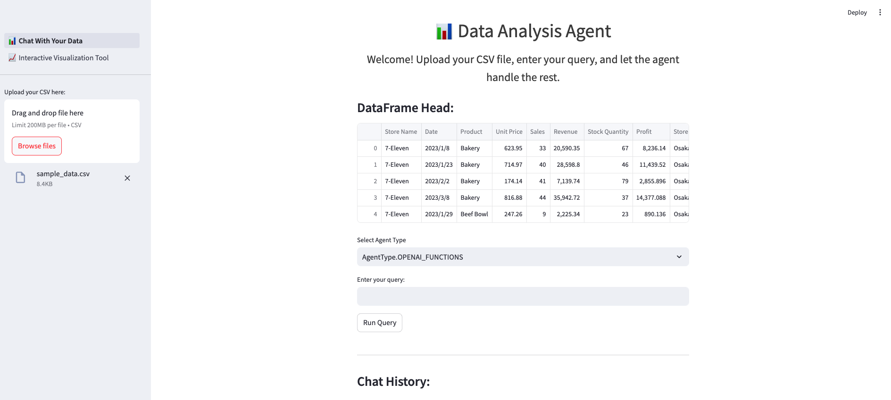
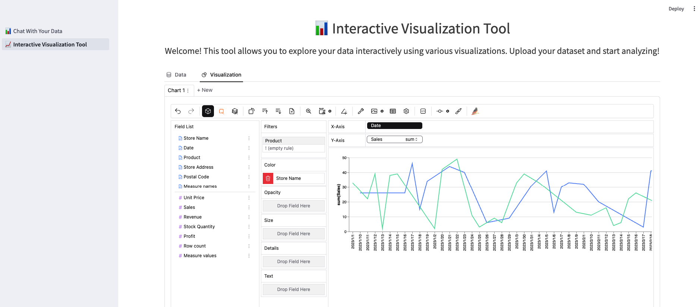

# DAGPT: Data Analysis GPT

DAGPT is a data analysis tool that uses LLMs (Large Language models) to assist with data manipulation and analysis tasks via a conversational interface. This project leverages Streamlit to provide an interactive web application where users can upload their data, ask questions, explore your data interactively and receive insights.

## Features

- **CSV File Upload**: Easily upload your CSV data through the sidebar.
- **Data Analysis**: Enter queries about your data and get responses powered by LLMs.
- **Data Visualization**: Generate and display plots based on your data queries.
- **Interactive Visualization Tool**: Explore your data interactively using various visualizations. Upload your dataset and start analyzing with drag-and-drop functionality to create customized charts.

## Application Interface

### Chat With Your Data


Welcome! Upload your CSV file, enter your query, and let the agent handle the rest.

### Interactive Visualization Tool


Welcome! This tool allows you to explore your data interactively using various visualizations. Upload your dataset and start analyzing!

### Demo Video


## Getting Started

### Prerequisites

- Python 3.9 or higher
- pip (Python package installer)

### Installation

1. Clone the repository:

   ```bash
   git clone https://github.com/acn-thaihanguyen/DAGPT.git
   cd DAGPT
   ```

2. Create a virtual enviroment:

    ```
    python -m venv .venv
    source .venv/bin/activate   # On Windows use `.venv\Scripts\activate`
    ```

3. Install the required dependencies:

   ```bash
   pip install -r requirements.txt
   ```

4. Set up environment variables:
    Create a `.env` file in the root directory of the project and add your environment variables. Example is provided in `.env.sample`:

    ```
    # API keys
    OPENAI_API_KEY=your_openai_api_key
    GOOGLE_API_KEY=your_google_api_key

    # Python path
    PYTHONPATH=/path/to/dagpt/folder
    ```

### Running the Application

To start the Streamlit app, run the following command in your terminal:

```bash
streamlit run 1_📊_Chat With Your Data.py
```

This will launch the web application in your default web browser.

### Usage

1. Upload a CSV file containing your data.
2. Use the text input to ask questions about the data.
3. Use the interactive visualization tool to explore your data and create visualizations.

## Project Structure

```
├── README.md
├── 1_📊_Chat With Your Data.py
├── dagpt
│   ├── agents
│   │   ├── base.py
│   │   └── pandas_agent.py
│   ├── models
│   │   └── llms.py
│   ├── prompts
│   │   └── prompts.py
│   ├── tools
│   │   ├── tools.py
│   │   └── tools_ori.py
│   └── utils
│       └── utils.py
├── data
│   └── sample_data.csv
├── notebooks
├── pages
│   └── 2_📈_Interactive Visualization Tool.py
├── requirements.txt
│── images
│   └── chat_with_data.png
│   └── interactive_visualization_tool.png
└── videos
    └── demo_video_01.mp4
    └── demo_video.gif
```

### Project Components

- `1_📊_Chat With Your Data.py`: Script for the "Chat With Your Data" feature.
- `dagpt/agents`: Contains the agent classes responsible for handling user queries.
  - `base.py`: Base class for agents.
  - `pandas_agent.py`: Agent specifically designed for handling pandas DataFrames.
- `dagpt/models`: Contains the language model classes.
  - `llms.py`: Class for interacting with GPT models.
- `dagpt/prompts`: Contains prompt templates for the agents.
  - `prompts.py`: Prompt templates for different scenarios.
- `dagpt/tools`: Contains utility tools for data manipulation and model interactions.
  - `tools.py`: Customized tools module.
  - `tools_ori.py`: Original tools module.
- `dagpt/utils`: General utility functions.
  - `utils.py`: Utility functions used throughout the project.
- `data`: Directory for storing sample data files.
  - `sample_data.csv`: A sample CSV file for testing.
- `notebooks`: Directory for Jupyter notebooks (for experiments and testing).
- `pages`: Directory for additional Streamlit pages.
  - `2_📈_Interactive Visualization Tool.py`: Script for the interactive visualization tool.
- `requirements.txt`: List of required Python packages.
- `images`: Directory for storing demo images.
  - `chat_with_data.png`: Image showing the "Chat With Your Data" interface.
  - `interactive_visualization_tool.png`: Image showing the "Interactive Visualization Tool" interface.
- `videos`: Directory for storing demo videos.

## Contributing

Contributions are welcome! Please open an issue or submit a pull request on GitHub.

## Acknowledgements

- [LangChain](https://github.com/langchain-ai/langchain)
- [Streamlit](https://www.streamlit.io/)
- [Pygwalker](https://github.com/Kanaries/pygwalker)

## License

This project is licensed under the MIT License - see the LICENSE file for details.
